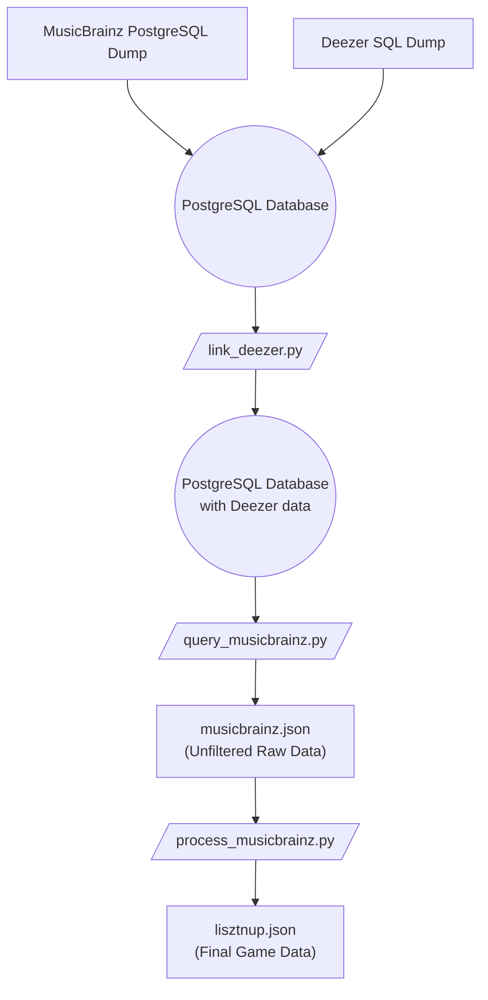

# Dataset Generation Process

This document outlines the steps to generate the `lisztnup.json` dataset.

### Data Sources

You will need the following primary data dumps:

1.  **MusicBrainz PostgreSQL Data Dump**
    - **Source:** [metabrainz.org/datasets/postgres-dumps](https://metabrainz.org/datasets/postgres-dumps#musicbrainz)
    - **Setup:** A local PostgreSQL database instance loaded with this data is required.

2.  **Deezer Track ID Dump**
    - **Source:** [github.com/MusicMoveArr/Datasets](https://github.com/MusicMoveArr/Datasets)
    - **File Needed:** `deezer_track.sql` should be copied into this directory.

Make sure you have sufficient disk space.

---

### Generation Steps

The process is executed by three Python scripts in the following order:

1.  **Link Deezer Data (`link_deezer.py`)**
    - This script connects to the PostgreSQL database and imports the Deezer track data. It creates a `musicbrainz.deezer` table, mapping ISRC codes to Deezer Track IDs.

2.  **Extract Raw Data (`query_musicbrainz.py`)**
    - Queries the database to generate `musicbrainz.json`. This is a large, mostly unfiltered file containing the entire catalog of classical composers, their works, and recordings of those works, along with associated Deezer Track IDs where available. By default, only works with at least 2 recordings are included.

3.  **Filter and Finalize (`process_musicbrainz.py`)**
    - Takes `musicbrainz.json` as input and applies several filtering metrics (e.g., composer relevance, work popularity) to produce the final, optimized `lisztnup.json` for the game.

---

### Post-Processing

After generating the final dataset, an additional validation step is recommended:

**Validate Deezer Previews (`process_deezer.py`)**

- This script checks all Deezer Track IDs in `lisztnup.json` to verify that preview MP3s are available via the Deezer API.
- IDs without previews or with API errors are added to `excluded_deezer_ids`.
- **Recheck Mode:** Set `recheck_excluded = True` to verify previously excluded IDs and remove them if previews become available.
- After running, re-run `process_musicbrainz.py` to regenerate `lisztnup.json` with the updated exclusion list. You may run `process_deezer.py` and `process_musicbrainz.py` alternately until no new IDs are excluded.
